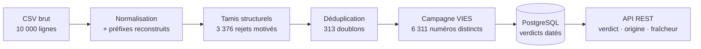

# valid_tva — Validation de numéros de TVA intracommunautaire


Qualification d'un référentiel de 10 000 numéros de TVA (Meridian Distribution) :
**valide / invalide / indéterminé**, via normalisation, validation structurelle,
vérification VIES, et une API REST consultée avant chaque facturation hors taxe.

> « Parmi nos 10 000 numéros, lesquels sont valides, lesquels ne le sont pas —
> et lesquels n'ont pas pu être tranchés ? » — la question du brief, à laquelle
> chaque ligne de ce dépôt répond.

Brief pédagogique — formation Data Engineer, 2026. Auteur : Greg Martin.

## Résultats

<!-- refresh after pass 3 (evening 2026-09-10) -->
État au 10/09/2026 au soir (2 passages de campagne ; les indéterminés restent
re-vérifiables à chaque passage) :

| Verdict | Lignes | Détail |
|---|---:|---|
| **Invalide** | 9 104 | 3 376 rejets structurels motivés + 5 728 invalidés par VIES |
| **Indéterminé** | 667 | VIES saturé ou indisponible — jamais confondu avec invalide |
| **Valide** | 229 | confirmés par VIES, nom et adresse à l'appui |

La validation structurelle évite **3 689 appels VIES (−36,9 %)** avant le
premier octet réseau. Chiffres recalculés depuis la base à chaque exécution du
[rapport de réconciliation](sql/verdict_reconciliation.sql) (commande ci-dessous).

## Pipeline



Les décisions structurantes (préfixes reconstruits, définition du doublon,
GB/UK post-Brexit, clés de contrôle maison, fraîcheur sans péremption) sont
motivées dans la [note d'architecture](docs/architecture.md) ; leur histoire
se lit dans le [journal de bord](docs/journal.md).

## Technologies

| Outil | Rôle | Pourquoi |
|---|---|---|
| Python 3.13 + [uv](https://docs.astral.sh/uv/) | pipeline & outillage | reproductibilité (lockfile), rapidité |
| PostgreSQL 16 (Docker) | référentiel + verdicts | fourni par le kit ; schéma SQL versionné |
| httpx | client VIES (API REST) | timeouts explicites, client moderne |
| FastAPI | API de vérification | OpenAPI générée automatiquement |
| ruff, pytest | qualité | lint + tests, localement et en CI |

## Démarrage rapide

Prérequis : Docker et [uv](https://docs.astral.sh/uv/) installés.

```bash
git clone https://github.com/GMartin-Data/valid_tva.git && cd valid_tva
docker compose up -d --wait && uv sync && uv run python -m valid_tva.load && uv run uvicorn --factory valid_tva.api:app
```

La pile complète — base PostgreSQL saine (healthcheck), dépendances,
chargement idempotent, API — en une commande. Aucun fichier d'environnement
requis : les variables `POSTGRES_*` (host, port, user, password, db)
surchargent les défauts si besoin (port 5435, identifiants
meridian/meridian/tva).

<details>
<summary><strong>Pas à pas commenté</strong> (mêmes étapes, une par une)</summary>

```bash
# 1. Base PostgreSQL (--wait : attend le healthcheck, pas juste le démarrage)
docker compose up -d --wait

# 2. Dépendances Python
uv sync

# 3. Chargement du référentiel (idempotent : rejouable sans doublon,
#    et sans écraser les verdicts VIES déjà acquis)
uv run python -m valid_tva.load

# Répartition des verdicts structurels par motif
docker exec -i meridian_tva_db psql -U meridian -d tva -f - < sql/motive_distribution.sql

# 4. Campagne de vérification VIES (rejouable : les indéterminés et les
#    verdicts périmés sont repris à chaque passage ; --limit = mode échantillon)
uv run python -m valid_tva.campaign --limit 200

# Rapport de réconciliation : entonnoir et doublons, motifs de rejet, état
# de campagne, qualification des 10 000 lignes (verdict × origine)
docker exec -i meridian_tva_db psql -U meridian -d tva -f - < sql/verdict_reconciliation.sql

# 5. API de vérification
uv run uvicorn --factory valid_tva.api:app
```

</details>

## API

`GET /vat/{numero}` accepte un numéro même bruité (`fi 2660-63.69`), avec
`?country=XX` pour reconstruire un préfixe pays manquant. Tout verdict est un
`200` — « invalide » est une réponse, pas une erreur. Documentation interactive
sur `/docs` (OpenAPI sur `/openapi.json`).

```bash
curl http://127.0.0.1:8000/vat/BE0415621046
```

```json
{
    "input": "BE0415621046",
    "vat_number": "BE0415621046",
    "verdict": "valid",
    "origin": "vies",
    "motive": null,
    "checked_at": "2026-09-08T10:06:52.095000Z",
    "stale": false,
    "name": "NV PLUTO",
    "address": "Merellaan 46\n9400 Ninove"
}
```

| Champ | Valeurs | Sens |
|---|---|---|
| `verdict` | `valid` / `invalid` / `unknown` | `unknown` = l'indéterminé du brief, pas un mauvais numéro |
| `origin` | `structural` / `vies` / `never_checked` | d'où sort le verdict (`motive` renseigné si structurel) |
| `checked_at`, `stale` | date VIES, `true` > 7 jours | le verdict est toujours servi, jamais retenu ; l'API ne contacte jamais VIES elle-même |

## Structure

```
data/          référentiel source (CSV, 10 000 lignes)
exploration/   scripts one-shot d'exploration (traçabilité, hors production)
src/valid_tva/ code du pipeline et de l'API
sql/           schéma PostgreSQL et rapports SQL versionnés
docs/          journal de bord, note d'architecture
```
